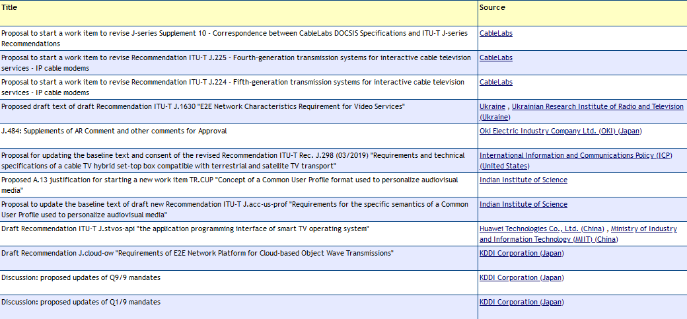

# 2. Overzicht gegevensverzameling per SDO

## 2.1 CEN en CENELEC

CEN en CENELEC (*Comité Européen de Normalisation - Comité Européen de Normalisation Élecrotechnique*) heeft **nationale vertegenwoordigingen**, wat betekent dat namens Nederland de NEN lid is. Er worden experts afgevaardigd vanuit de NEN-normcommissies om die Nederlandse positie te vertegenwoordigen. Zij kunnen ook individueel deelnemen aan het opstellen van standaarden. Voor gegevens over individuele participaties zijn wij daarom afhankelijk van NEN. Het is niet mogelijk gebleken om voor afronding van deze studie die gegevens op te halen.

## 2.2 ETSI

ETSI (*European Telecommunications Standards Institute*) heeft een gemengde ledenstructuur. Van oorsprong kunnen organisaties lid worden van ETSI. Deze leden hebben dan stemrecht. Echter, onder druk van de EC moet voor geharmoniseerde standaarden gestemd worden door lidstaten. Daarom heeft ETSI voor geharmoniseerde standaarden nu een andere stemprocedure. Hierbij moet als kanttekening worden geplaatst dat stemmen niet vaak voorkomt. Uit onderzoek blijkt dat ETSI doorgaans met een consensusmodel beslist, bijvoorbeeld in 95,4% van de gevallen in het General Assembly. Het standaardisatieproces gaat echter nog wel zoals voorheen, door werkgroepen met de bestaande leden. Daarom richten wij ons voor deelname aan standaardisatie binnen ETSI op de organisatielidmaatschappen.

Nederlandse ETSI-leden zijn verenigd in NELO (Nederlands ETSI-Leden Overleg). Positiebepaling voor geharmoniseerde standaarden gaat via NEPE (Nederlandse ETSI-EN Public Enquiry).

Om gegevens van ETSI te achterhalen hebben wij van het ministerie van Economische Zaken onder voorwaarden toegang gekregen tot het ledenportaal.

Voor ETSI hebben wij de volgende gegevens kunnen ophalen:

- Per orgaan binnen ETSI (bijv. WG/TC):

  - Afkorting

  - Naam

  - Leden met rol waar van toepassing

  - Meetings van het orgaan

- Per lid:

  - Naam

  - Organisatie

- Per meeting van een orgaan:

  - Datum

  - Aanwezigen

  - Evt. formele rol van aanwezige

- Per organisatie:

  - Naam

  - Landcode

## 2.3 3GPP

3GPP (*3rd Generation Partnership Project*) heeft een structuur met zeven *Organisational Partners*. Deze zeven zijn regionale SDO’s op het gebied van telecom, ETSI namens Europa. De verdere partners zijn de Japanse *Association of Radio Industries and Business* en het *Telecommunication Technology Committee,* de Amerikaanse *Alliance for Telecommunications Industry Solutions*, de *China Communications Standards Association,* de Indiase *Telecommunications Standards Development Society* en de Zuid-Koreaanse *Telecommunictions Technology Association*. Leden van deze SDO’s kunnen zich ook aanmelden bij 3GPP. De vertegenwoordigers worden doorgaans bij naam genoemd, met organisatie ook beschikbaar.

Voor 3GPP hebben wij de volgende gegevens kunnen ophalen:

- Per orgaan binnen 3GPP (bijv. WG/TC):

  - Code

  - Naam

  - Beschrijving

  - Leden met rol waar van toepassing

  - Meetings van het orgaan

- Per lid:

  - Naam

  - Organisatie

- Per meeting van een orgaan:

  - Datum

  - Aanwezigen

  - Evt. formele rol van aanwezige (bijv: DELEGATE of CHAIR)

- Per organisatie:

  - Naam

  - Landcode (onvolledig)

## 2.4 ITU

Binnen ITU (*International Telecommuncation Union*) ligt onze focus op studiegroepen van de ITU-T de tak van ITU waarbinnen gewerkt wordt aan standaarden. Binnen ITU zijn organisaties, individuen én landen lid. Zij kunnen dus ook een vertegenwoordiging sturen, rol vervullen of *technical contributions* indienen.geeft een illustratie van *technical contributions*. Ook bij ITU hebben wij via het ministerie van Economische Zaken toegang gekregen tot de gegevens.

> Figuur 1. Technical contributions ITU. Bron: [\[itu.int\]](https://www.itu.int/md/T22-SG09-231114-C/en)

Voor ITU bleek het onrealistisch om gegevens over de participatie te achterhalen, met uitzondering van formele rollen en *technical contributions*. Overige gegevens over participatie bleken slechts toegankelijk voor leden van de individuele werkgroepen.

Dit levert de volgende gegevens op:

- Per orgaan binnen ITU (bijv. WG/TC):

  - Code

  - Naam

  - Beschrijving

  - Leden met formele rol

  - Technische contributies

- Per lid met formele rol:

  - Naam

  - Organisatie

- Per technische contributie:

  - Titel

  - Ondertekenende organisaties

- Per organisatie:

  - Naam

## 2.5 ISO

Bij ISO zijn nationale standaardisatie-organisaties lid, namens Nederland NEN. Andere organisaties (voornamelijk SDO’s) kunnen wel voorstellen indienen. Naar buiten toe worden de lidmaatschappen van de technische commissies per land weergegeven. Er worden wel experts afgevaardigd vanuit de NEN normcommissies om die Nederlandse positie te vertegenwoordigen. NEN heeft voor dit onderzoek gegevens opgevraagd bij ISO over de Nederlandse experts die deelnemen aan werkgroepvergaderingen. Dit bevat voor de jaren 2019 tot en met 2024 de volgende gegevens:

- TC/Werkgroep code

- TC/Werkgroep naam

- Meeting id

- Meeting type

- Startdatum

- Einddatum

- Aantal deelnemers namens Nederland

## 2.6 IEC

Bij IEC kan per land één *National Committee* lid worden. Namens Nederland is dat het Netherlands Electrotechnical Committee (NEC). Binnen commissies kan net als bij ISO een rol als deelnemend lid worden gekozen of een rol als observer. Nederland is volwaardig lid, maar een aantal landen is ook affiliate. Er worden wel experts afgevaardigd vanuit NEN normcommissies om die Nederlandse positie te vertegenwoordigen. Hiervoor heeft NEN voor dit onderzoek gegevens opgevraagd bij IEC over de Nederlandse experts die deelnemen aan werkgroepvergaderingen. Dit bevat voor de jaren 2019 tot en met 2024 de volgende gegevens:

- Naam participant

- Meeting

- Meeting type

- Beschrijving

- Rol bij de meeting

- Main meeting (congres waar meeting deel van uitmaakt)

- Locatie

- Wijze van participatie

- Goedkeuring participatie

- Registratie (Submitted/Not submitted)

- Startdatum

- Einddatum

## 2.7 IETF

IETF heeft geen ledenstructuur. Iedereen kan zich aanmelden voor een werkgroep en wordt verwacht deel te nemen als individu. Deelnemers zijn dan dus niet organisatiegebonden, maar vaak wel afgevaardigde. IETF heeft een datatracker, waar langs een openbare API gegevens kunnen worden opgevraagd. Voor meetings zijn er verder zogeheten *bluenotes*, waarin aanwezigen met affiliatie staan voor elke meeting.

Voor IETF zijn de volgende gegevens opgehaald:

- Per orgaan binnen IETF (bijv. WG/TC):

  - Afkorting

  - Naam

  - Beschrijving

  - Type (volgens de hiërarchie van IETF; 23 categorieën)

  - Parentorgaan (de organen zijn in een boomstructuur opgesteld en hangen uiteindelijk allen onder IETF zelf)

  - Leden

  - Meetings van het orgaan

- Per lid:

  - Naam

  - E-mailadres

  - Naam van organisatie, mits via de Datatracker of bluenotes herleidbaar

- Per meeting van een orgaan:

  - Datum

  - Aanwezigen

## 2.8 IEEE-SA

IEEE-SA is de standaardisatie-organisatie van IEEE. Lidmaatschap van IEEE-SA kan als individu (bijvoorbeeld als student of als professional) of organisatie. Voor IEEE is het niet gelukt om toegang te krijgen tot gegevens over participatie op het gewenste niveau. Deze waren niet openbaar online beschikbaar en wij hebben hiervoor ook geen medewerking kunnen verkrijgen.

## 2.9 W3C

W3C draait om organisatielidmaatschap. Individuen mogen deelnemen, maar doen dat dan in de rol van “invited expert”. W3C heeft een goed toegankelijke API. Hier kan worden opgehaald wie lid is van werkgroepen, welke formele rol zij hebben en welke affiliaties deze personen hebben. De onderstaande gegevens waren daardoor eenvoudig beschikbaar.

- Per orgaan binnen W3C (bijv. WG/TC):

  - Naam

  - Beschrijving

  - Type (optioneel)

  - Leden met formele rol waar relevant

- Per lid:

  - Naam

  - E-mailadres (mits zelf opgegeven)

  - Land (mits zelf opgegeven)

  - Naam van de organisatie

## 2.10 OASIS

OASIS heeft organisatielidmaatschap. Medewerkers van leden kunnen deelnemen aan standaardisatieprocessen. Het maakt standaarden via technical committees (TC’s), maar er is ook ruimte voor open projecten. Voor OASIS hebben wij de volgende gegevens kunnen achterhalen:

- Per orgaan binnen OASIS (bijv. WG/TC):

  - Afkorting

  - Naam

  - Leden

- Per lid:

  - Naam (optioneel)

  - Naam van de organisatie

